\begin{center}
\textbf{\LARGE SPRAWOZDANIE}\\
\begin{Large}
Zajęcia: Analiza procesów uczenia\\
Prowadzący: prof. dr hab. Vasyl Martsenyuk\\
\end{Large}

\vspace{5cm}
\textbf{Laboratorium 1}\\
\textbf{\today}\\
\textbf{Temat:} Podstawy języka R\\
\textbf{Wariant:} 1\\
\textbf{Adres repozytorium:} \url{https://github.com/Konradbor/APU/tree/master/1}\\
\end{center}

\vfill

\begin{flushright}
Konrad Boroń\\
Informatyka II stopień,\\
stacjonarne,\\
7 semestr,\\
Gr. 1A\\
\end{flushright}
\pagebreak

1. Polecenie:

\begin{framed}

   Do zmiennej a podstaw wartość wyrażenia 2 * exp(5). 
   Do zmiennej b podstaw podwojona wartość zmiennej a.
   Wywolaj funkcje sprawdzajaca, która z wartości zmiennych jest wieksza.
\end{framed}

2. Wprowadzane dane:

   ```r
> a <- 2*exp(5)
> b <- 2*a
> max(a,b)
   ```

4. Wynik działania:
   
   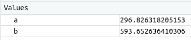

   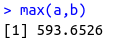

---

1. Polecenie:

\begin{framed}
   Uruchom i poczytaj dokumentacje dla funkcji sum().
\end{framed}

2. Wprowadzane dane:

   ```r
> help(sum)
   ```

4. Wynik działania:
   
   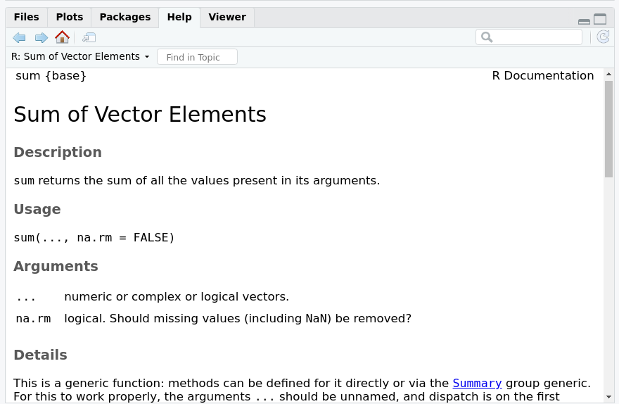

---

1. Polecenie:

\begin{framed}
   Stwórz wektor a zawierajacy liczby od 15 od 25. Policz sume liczb
zawartych w wektorze.
\end{framed}

2. Wprowadzane dane:

   ```r
> a <- 15:25
> sum(a)
   ```

4. Wynik działania:
   
   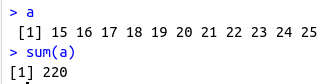

---

1. Polecenie:

\begin{framed}
   Wyświetl wszystkie funkcje zawierajace fraze sum w swojej nazwie.
\end{framed}

2. Wprowadzane dane:

   ```
> apropos("sum", mode = "function")
   ```

4. Wynik działania:
   
   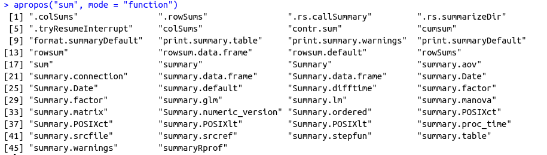


---

1. Polecenie:

\begin{framed}
   Ustaw dowolny katalog roboczy. Nastepnie stwórz zmienna a
zawierajaca lańcuch znaków "smartfony Samsung". Zapisz zmienna
a z obszaru roboczego do pliku w katalogu roboczym. Nastepnie
usuń zmienna a. Sprawdź wartość zmiennej a (powinno jej brakować).
Na końcu wczytaj plik ze zmienna a i sprawdź jej wartość.
\end{framed}

2. Wprowadzane dane:

   ```r
> a = "smartfony Samsung"
> save.image("~/Dokumenty/APU/1/e.RData")
> remove(a)
> load("~/Dokumenty/APU/1/e.RData")
   ```

4. Wynik działania:
   
   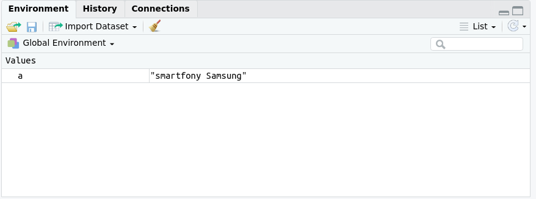

   
---

1. Polecenie:

\begin{mdframed}
Zainstaluj i zaladuj pakiet gridExtra, który umożliwia m.in ladna 
wizualizacje danych tabelarycznych. Nastepnie przy pomocy dokumentacji pakietu 
znajdź funkcje do wizualizacji danych tabelarycznych.
Użyj jej na pierwszych 10 wierszach zbioru danych mtcars.
\end{mdframed}

2. Wprowadzane dane:

   ```r
> install.packages("gridExtra")
> library(gridExtra)
> help(package = "gridExtra")
> g <- tableGrob(head(mtcars,10))
> grid.draw(g)
Błąd w poleceniu 'grid.draw(g)':nie udało się znaleźć funkcji 'grid.draw'
> library(grid)
> grid.draw(g)
   ```

4. Wynik działania:
   
   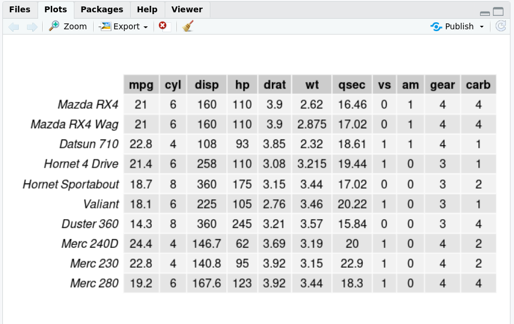


---

1. Polecenie:

\begin{mdframed}
Stwórz wektor zawierajacy ciag liczb 100, 96, 92,. . . 20.
\end{mdframed}

2. Wprowadzane dane:

   ```r
> a <- seq(100,20,-4)
   ```

4. Wynik działania:
   
   ```r
> a
 [1] 100  96  92  88  84  80  76  72  68  64  60  56  52  48  44  40  36  32  28  24  20
   ```


---

1. Polecenie:

\begin{mdframed}
Stwórz wektora a z liczbami od 9 do 5 oraz wektor b z liczbami od
11 do 16. Utwórz nowy wektory d bedacy polaczeniem wektora b
i a (w takiej kolejności). Wyświetl go.
\end{mdframed}

2. Wprowadzane dane:

   ```r
> a <- seq(9,5)
> b <- seq(11,16)
> d <- c(b, a)
   ```

4. Wynik działania:
   
   ```r
> d
 [1] 11 12 13 14 15 16  9  8  7  6  5
   ```

---

1. Polecenie:

\begin{mdframed}
Stwórz wektor nazwa zawierajay nazwy 10 smartfonów Samsung
z systemem Android 8 i osmiordzieniowym procesorem. Potem
stwórz wektory wyświetlacz, pamieć\_RAM i pamieć\_wbudowana,
aparat\_foto, cena, liczba\_opinii zawierajace kolejno dane 10 smartfonów.
Nastepnie stwórz ramke danych smartfony zlożona z wektorów
nazwa, wyświetlacz, pamieć\_RAM, pamieć\_wbudowana,
aparat\_foto, cena oraz liczba\_opinii. Wylicz średnia cene smartfonów.
\end{mdframed}

2. Wprowadzane dane:

   ```r
   > nazwa <- c("Galaxy J2 Core (2020)",
   +            "Galaxy Xcover FieldPro",
   +            "Galaxy A2 Core",
   +            "Galaxy View2",
   +            "Galaxy M30",
   +            "Galaxy M20",
   +            "Galaxy M10",
   +            "Galaxy Tab Advanced2",
   +            "Galaxy Tab A 8.0 (2018)",
   +            "Galaxy A6s")
   > wyświetlacz <- c(5.0,
   +                  5.1,
   +                  5.0,
   +                  17.3,
   +                  6.4,
   +                  6.3,
   +                  6.22,
   +                  10.1,
   +                  8.0,
   +                  6.0)
   > pamięć_RAM <- c(1,
   +                 4,
   +                 1,
   +                 3,
   +                 3,
   +                 3,
   +                 2,
   +                 3,
   +                 2,
   +                 6)
   > pamieć_wbudowana <- c(
   +     16,
   +     64,
   +     8,
   +     64,
   +     32,
   +     32,
   +     16,
   +     32,
   +     32,
   +     64
   + )
   > aparat_foto <- c(8,
   +                  12,
   +                  5,
   +                  0,
   +                  13,
   +                  13,
   +                  13,
   +                  8,
   +                  8,
   +                  12)
   >     cena <- c(80,
   +              1020,
   +              120,
   +              660,
   +              300,
   +              300,
   +              135,
   +              200,
   +              130,
   +              300)
   > liczba_opinii <- c(17,
   +                    48,
   +                    36,
   +                    50,
   +                    316,
   +                    358,
   +                    107,
   +                    8,
   +                    40,
   +                    86)
   > ramka <- data.frame(nazwa, wyświetlacz, pamięć_RAM, pamieć_wbudowana,
   +                     aparat_foto, cena, liczba_opinii)
   ```

4. Wynik działania:
   
   ```r
> mean(ramka$cena)
[1] 324.5
   ```

---

1. Polecenie:

\begin{mdframed}
Do stworzonej w poprzednim zadaniu ramki danych smartfonów
dodaj wpis zawierajacy dane nowego smartfonu. Wylicz średnia 
ceny ponownie.
\end{mdframed}

2. Wprowadzane dane:

   ```r
   > ramka <- rbind(ramka, data.frame(nazwa = "Galaxy A9 (2018)", wyświetlacz = 6.3, pamięć_RAM = 6, pamieć_wbudowana = 64,
 aparat_foto = 24, cena = 359, liczba_opinii = 320))

   ```

4. Wynik działania:
   
   ```r
> mean(ramka$cena)
[1] 327.6364
   ```

---

1. Polecenie:

\begin{mdframed}
Korzystajac z ramki danych smartfony dodaj nowa kolumne określajac
ocene klientów. Wpisz do kolumny odpowiednio oceny w skali od
0 do 5 krok 0.5. Dodana kolumna powinna sie automatycznie
przekonwertować do cech jakościowych (tzw. factors). Wylicz
średnia ceny każdej oceny.
\end{mdframed}

2. Wprowadzane dane:

   ```r
> ramka$ocena <- factor(c(3, 5, 5, 4, 4, 4, 4, 5, 4.5, 5, 4.5))
   ```

4. Wynik działania:
   
   ```r
> mean(as.numeric(levels(ramka$ocena)[ramka$ocena]))
[1] 4.363636
   ```

---

1. Polecenie:

\begin{mdframed}
Do ramki danych smartfony dodaj kolejne 4 smartfony. Narysuj
na wykresie slupkowym liczebność reprezentantów każdej z ocen klientow.
\end{mdframed}

2. Wprowadzane dane:

   ```r
ramka <- rbind(ramka, data.frame(nazwa = c("Galaxy A7 (2018)",
"Galaxy Note9",
"Galaxy J6+",
"Galaxy J4 Core"
),
wyświetlacz = c(6.0,6.4,6.0,6.0), 
pamięć_RAM = c(4,6,3,1),
pamieć_wbudowana = c(64,128,32,16),
aparat_foto = c(12,12,10,5),
cena = c(309,820,230,150),
liczba_opinii = c(223,1243,198,87),
ocena = factor(c(4,5,4,3.5)))
)
   ```

4. Wynik działania:
   
   ```r
> barplot(table(ramka$ocena))
   ```
   
   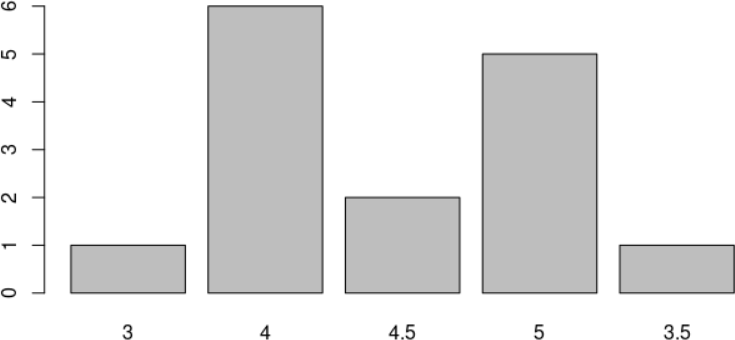

---

1. Polecenie:

\begin{mdframed}
Wykorzystujac ramke danych smartfony pokaż procentowy udzial
każdej oceny przy pomocy wykresu kolowego oraz wachlarzowego.
\end{mdframed}

2. Wprowadzane dane:

   ```r
>install.packages("plotrix")
>library(plotrix)
> prop.table(table(ramka$ocena))

         3          4        4.5          5        3.5 
0.06666667 0.40000000 0.13333333 0.33333333 0.06666667 

   ```

4. Wynik działania:
   
   ```r
> pie(prop.table(table(ramka$ocena)))
> fan.plot(prop.table(table(ramka$ocena)), labels = names(prop.table(table(ramka$ocena))))
   ```
   
   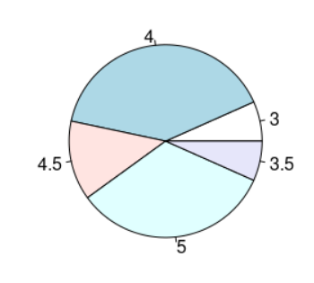

   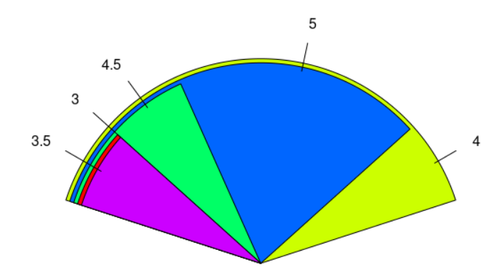

---

1. Polecenie:

\begin{mdframed}
Do ramki danych smartfony dodaj nowa kolumn status\_opinii z
wartościami: "nie ma", "mniej 50 opinii", "50-100 opinii", "wiecej
100 opinii" w zależności od liczby opinii. Zamień dodana kolumne 
na cechy jakościowe. Nastepnie przy pomocy wykresu kolowego
wyrysuj procentowy udzial smartfonów o konkretnym statusie opinii.
\end{mdframed}

2. Wprowadzane dane:

   ```r
>status_opinii <- 
   ifelse(ramka$liczba_opinii == 0, "nie ma", 
   ifelse(ramka$liczba_opinii < 50, "mniej niż 50 opinii",
   ifelse(ramka$liczba_opinii <= 100, "50-100 opinii", "więcej niż 100 opinii")))
> status_opinii <- factor(status_opinii)
> ramka$status_opinii <- status_opinii
```

4. Wynik działania:
   
   ```r
> pie(prop.table(table(ramka$status_opinii)))
   ```

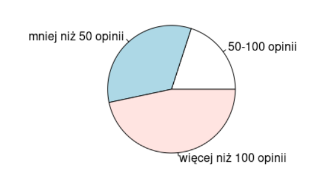

---

1. Polecenie:

\begin{mdframed}
Wykorzystujac ramke danych smartfony stwórz zdanie o każdym z
smartfonów postaci: nazwa + " ma ocene klientów " + ocena\_klientów + 
"bo ma liczbe opinii" + liczba\_opinii. Plus oznacza konkatenacje
lańcuchów i wartości.
\end{mdframed}

2. Wprowadzane dane:

   ```r
   > for (i in 1:nrow(ramka)) {
   +     row <- ramka[i,]
   +     print(paste(row$nazwa, "ma ocene klientow", row$ocena, "bo ma liczbę opinii", row$liczba_opinii))    
   + }
   ```

4. Wynik działania:
   
   ```r
[1] "Galaxy J2 Core (2020) ma ocene klientow 3 bo ma liczbę opinii 17"
[1] "Galaxy Xcover FieldPro ma ocene klientow 5 bo ma liczbę opinii 48"
[1] "Galaxy A2 Core ma ocene klientow 5 bo ma liczbę opinii 36"
[1] "Galaxy View2 ma ocene klientow 4 bo ma liczbę opinii 50"
[1] "Galaxy M30 ma ocene klientow 4 bo ma liczbę opinii 316"
[1] "Galaxy M20 ma ocene klientow 4 bo ma liczbę opinii 358"
[1] "Galaxy M10 ma ocene klientow 4 bo ma liczbę opinii 107"
[1] "Galaxy Tab Advanced2 ma ocene klientow 5 bo ma liczbę opinii 8"
[1] "Galaxy Tab A 8.0 (2018) ma ocene klientow 4.5 bo ma liczbę opinii 40"
[1] "Galaxy A6s ma ocene klientow 5 bo ma liczbę opinii 86"
[1] "Galaxy A9 (2018) ma ocene klientow 4.5 bo ma liczbę opinii 320"
[1] "Galaxy A7 (2018) ma ocene klientow 4 bo ma liczbę opinii 223"
[1] "Galaxy Note9 ma ocene klientow 5 bo ma liczbę opinii 1243"
[1] "Galaxy J6+ ma ocene klientow 4 bo ma liczbę opinii 198"
[1] "Galaxy J4 Core ma ocene klientow 3.5 bo ma liczbę opinii 87"
   ```

---

1. Polecenie:

\begin{mdframed}
Zachować ramke danych w pliku .csv. Zaladować ramke danych z
pliku .csv
\end{mdframed}

2. Wprowadzane dane:

   ```r
   > write.csv(ramka, "smartfony.csv")
   > read.csv("smartfony.csv")
   ```

4. Wynik działania:
   
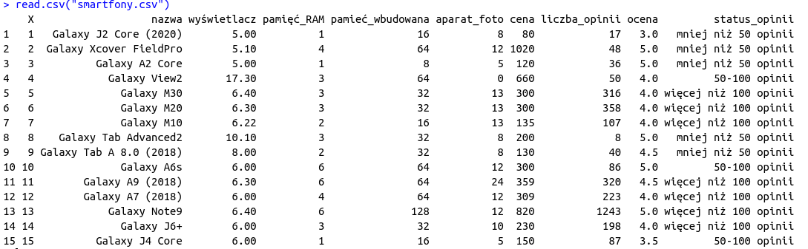

---