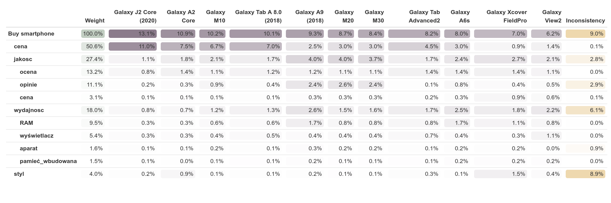

\begin{center}
\textbf{\LARGE SPRAWOZDANIE}\\
\begin{Large}
Zajęcia: Analiza procesów uczenia\\
Prowadzący: prof. dr hab. Vasyl Martsenyuk\\
\end{Large}

\vspace{5cm}
\textbf{Laboratorium 2}\\
\textbf{\today}\\
\textbf{Temat:} Procedura analitycznej hierarchizacji\\
\textbf{Wariant:} 1\\
\textbf{Adres repozytorium:} \url{https://github.com/Konradbor/APU/tree/master/2}\\
\end{center}

\vfill

\begin{flushright}
Konrad Boroń\\
Informatyka II stopień,\\
stacjonarne,\\
7 semestr,\\
Gr. 1A\\
\end{flushright}
\pagebreak

1. Polecenie:

\begin{mdframed}
Podjać decyzje ̨ o kupowaniu smartfonu Samsung z systemem Android
6, ośmiordzieniowym procesorem dla klienta. Dla klienta uda lo sie ̨
określić cztery kryteria, które powinny s lużyć ocenie smartfonu: wyda-
jność, jakość, styl, cena. Na podstawie wzgle ̨dnej ważności poszczególnych
kryteriów wybrać dla klienta smartfon. Uwzglendniamy naste ̨pija ̨ce
dane: wyświetlacz, pamie ̨ć RAM, pamie ̨ć wbudowana, aparat foto,
cena. Komunikacja (wifi itp) nie ma znaczenia. Dane (10 smartfonów)
pobrać ze strony
http://www.euro.com.pl
\end{mdframed}

2. Wprowadzane dane:

```yaml
Version: 2.0

#########################
# Alternatives Section
#

Alternatives: &alternatives
# Here, we list all the alternatives, together with their attributes. 
# We can use these attributes later in the file when defining 
# preferenceFunctions. The attributes can be quantitative or 
# qualitative.
  Galaxy A2 Core:
    wyświetlacz: 5.0
    pamięć_RAM: 1.0
    pamieć_wbudowana: 8.0
    aparat_foto: 5.0
    cena: 120.0
    liczba_opinii: 36.0
    ocena: '5'
    status_opinii: mniej niż 50 opinii
  Galaxy A6s:
    wyświetlacz: 6.0
    pamięć_RAM: 6.0
    pamieć_wbudowana: 64.0
    aparat_foto: 12.0
    cena: 300.0
    liczba_opinii: 86.0
    ocena: '5'
    status_opinii: 50-100 opinii
  Galaxy A9 (2018):
    wyświetlacz: 6.3
    pamięć_RAM: 6.0
    pamieć_wbudowana: 64.0
    aparat_foto: 24.0
    cena: 359.0
    liczba_opinii: 320.0
    ocena: '4.5'
    status_opinii: więcej niż 100 opinii
  Galaxy J2 Core (2020):
    wyświetlacz: 5.0
    pamięć_RAM: 1.0
    pamieć_wbudowana: 16.0
    aparat_foto: 8.0
    cena: 80.0
    liczba_opinii: 17.0
    ocena: '3'
    status_opinii: mniej niż 50 opinii
  Galaxy M10:
    wyświetlacz: 6.22
    pamięć_RAM: 2.0
    pamieć_wbudowana: 16.0
    aparat_foto: 13.0
    cena: 135.0
    liczba_opinii: 107.0
    ocena: '4'
    status_opinii: więcej niż 100 opinii
  Galaxy M20:
    wyświetlacz: 6.3
    pamięć_RAM: 3.0
    pamieć_wbudowana: 32.0
    aparat_foto: 13.0
    cena: 300.0
    liczba_opinii: 358.0
    ocena: '4'
    status_opinii: więcej niż 100 opinii
  Galaxy M30:
    wyświetlacz: 6.4
    pamięć_RAM: 3.0
    pamieć_wbudowana: 32.0
    aparat_foto: 13.0
    cena: 300.0
    liczba_opinii: 316.0
    ocena: '4'
    status_opinii: więcej niż 100 opinii
  Galaxy Tab A 8.0 (2018):
    wyświetlacz: 8.0
    pamięć_RAM: 2.0
    pamieć_wbudowana: 32.0
    aparat_foto: 8.0
    cena: 130.0
    liczba_opinii: 40.0
    ocena: '4.5'
    status_opinii: mniej niż 50 opinii
  Galaxy Tab Advanced2:
    wyświetlacz: 10.1
    pamięć_RAM: 3.0
    pamieć_wbudowana: 32.0
    aparat_foto: 8.0
    cena: 200.0
    liczba_opinii: 8.0
    ocena: '5'
    status_opinii: mniej niż 50 opinii
  Galaxy View2:
    wyświetlacz: 17.3
    pamięć_RAM: 3.0
    pamieć_wbudowana: 64.0
    aparat_foto: 0.0
    cena: 660.0
    liczba_opinii: 50.0
    ocena: '4'
    status_opinii: 50-100 opinii
  Galaxy Xcover FieldPro:
    wyświetlacz: 5.1
    pamięć_RAM: 4.0
    pamieć_wbudowana: 64.0
    aparat_foto: 12.0
    cena: 1020.0
    liczba_opinii: 48.0
    ocena: '5'
    status_opinii: mniej niż 50 opinii

#
# End of Alternatives Section
#####################################

#####################################
# Goal Section
#


Goal:
# The goal spans a tree of criteria and the alternatives
  name: Buy smartphone
  author: Konrad
  preferences:
    # preferences are typically defined pairwise
    # 1 means: A is equal to B
    # 9 means: A is highly preferrable to B
    # 1/9 means: B is highly preferrable to A
    pairwise:
      - [cena, jakosc, 3]
      - [cena, styl, 7]
      - [cena, wydajnosc, 3]
      - [jakosc, styl, 9]
      - [jakosc, wydajnosc, 2]
      - [styl, wydajnosc, 1/7]
  children: 
    cena:
      preferences: 
        pairwiseFunction:
          function(a1, a2) min(9, max(1/9, a2$cena/a1$cena))
      children: *alternatives
          # We don't need to retype the alternatives here. Instead
          # we can simply make a reference to the alternatives anchor
          # defined in the alternatives section of the file.
    wydajnosc:
      preferences:
        pairwise:
          - [RAM, wyświetlacz, 3]
          - [RAM, pamieć_wbudowana, 5]
          - [RAM, aparat, 4]
          - [wyświetlacz, aparat, 4]
          - [pamieć_wbudowana, wyświetlacz, 1/5]
      children:
        RAM:
          preferences: 
            pairwiseFunction:
              function(a1, a2) min(9, max(1/9, a1$pamięć_RAM/a2$pamięć_RAM))
          children: *alternatives
        wyświetlacz:
          preferences: 
            pairwiseFunction:
              function(a1, a2) min(9, max(1/9, a1$wyświetlacz/a2$wyświetlacz))
          children: *alternatives
        pamieć_wbudowana:
          preferences: 
            pairwiseFunction:
              function(a1, a2) min(9, max(1/9, a1$pamieć_wbudowana/a2$pamieć_wbudowana))
          children: *alternatives
        aparat:
          preferences: 
            pairwiseFunction:
              function(a1, a2) min(9, max(1/9, a1$aparat_foto/a2$aparat_foto))
          children: *alternatives
    styl: 
      preferences: 
        pairwise:
          - [Galaxy A2 Core, Galaxy A6s, 6]
          - [Galaxy A2 Core, Galaxy A9 (2018), 6]
          - [Galaxy A2 Core, Galaxy J2 Core (2020), 6]
          - [Galaxy A2 Core, Galaxy M10, 6]
          - [Galaxy A2 Core, Galaxy M20, 6]
          - [Galaxy A2 Core, Galaxy M30, 6]
          - [Galaxy A2 Core, Galaxy Tab A 8.0 (2018), 6]
          - [Galaxy A2 Core, Galaxy Tab Advanced2, 6]
          - [Galaxy A2 Core, Galaxy View2, 6]
          - [Galaxy A2 Core, Galaxy Xcover FieldPro, 1/7]
          - [Galaxy Xcover FieldPro, Galaxy A6s, 7]
          - [Galaxy Xcover FieldPro, Galaxy A9 (2018), 7]
          - [Galaxy Xcover FieldPro, Galaxy J2 Core (2020), 7]
          - [Galaxy Xcover FieldPro, Galaxy M10, 7]
          - [Galaxy Xcover FieldPro, Galaxy M20, 7]
          - [Galaxy Xcover FieldPro, Galaxy M30, 7]
          - [Galaxy Xcover FieldPro, Galaxy Tab A 8.0 (2018), 7]
          - [Galaxy Xcover FieldPro, Galaxy Tab Advanced2, 7]
          - [Galaxy Xcover FieldPro, Galaxy View2, 7]
          - [Galaxy View2, Galaxy Tab Advanced2, 4]
          - [Galaxy View2, Galaxy Tab A 8.0 (2018), 4]
          - [Galaxy View2, Galaxy M30, 4]
          - [Galaxy View2, Galaxy M20, 4]
          - [Galaxy View2, Galaxy M10, 4]
          - [Galaxy View2, Galaxy J2 Core (2020), 4]
          - [Galaxy View2, Galaxy A9 (2018), 4]
          - [Galaxy View2, Galaxy A6s, 4]
          - [Galaxy Tab Advanced2, Galaxy Tab A 8.0 (2018), 3]
          - [Galaxy Tab Advanced2, Galaxy M30, 3]
          - [Galaxy Tab Advanced2, Galaxy M20, 3]
          - [Galaxy Tab Advanced2, Galaxy M10, 3]
          - [Galaxy Tab Advanced2, Galaxy J2 Core (2020), 3]
          - [Galaxy Tab Advanced2, Galaxy A9 (2018), 3]
          - [Galaxy Tab Advanced2, Galaxy A6s, 3]
          - [Galaxy Tab A 8.0 (2018), Galaxy M30, 1]
          - [Galaxy Tab A 8.0 (2018), Galaxy M20, 1]
          - [Galaxy Tab A 8.0 (2018), Galaxy M10, 1]
          - [Galaxy Tab A 8.0 (2018), Galaxy J2 Core (2020), 1]
          - [Galaxy Tab A 8.0 (2018), Galaxy A9 (2018), 1]
          - [Galaxy Tab A 8.0 (2018), Galaxy A6s, 1]
          - [Galaxy M30, Galaxy M20, 1/2]
          - [Galaxy M30, Galaxy M10, 1/2]
          - [Galaxy M30, Galaxy J2 Core (2020), 1/2]
          - [Galaxy M30, Galaxy A9 (2018), 1/2]
          - [Galaxy M30, Galaxy A6s, 1/2]
          - [Galaxy M20, Galaxy M10, 1/2]
          - [Galaxy M20, Galaxy J2 Core (2020), 1/2]
          - [Galaxy M20, Galaxy A9 (2018), 1/2]
          - [Galaxy M20, Galaxy A6s, 1/2]
          - [Galaxy M10, Galaxy J2 Core (2020), 1/2]
          - [Galaxy M10, Galaxy A9 (2018), 1/2]
          - [Galaxy M10, Galaxy A6s, 1/2]
          - [Galaxy J2 Core (2020), Galaxy A9 (2018), 3]
          - [Galaxy J2 Core (2020), Galaxy A6s, 3]
          - [Galaxy A9 (2018), Galaxy A6s, 3]
      children: *alternatives
    jakosc:
      preferences:
        pairwise:
          - [opinie, cena, 3]
          - [ocena, cena, 5]
      children:
        cena:
          preferences:
            pairwiseFunction:
              function(a1, a2) min(9, max(1/9, a1$cena/a2$cena))
          children: *alternatives
        opinie:
          preferences:
            pairwiseFunction:
              function(a1, a2) min(9, max(1/9, a1$liczba_opinii/a2$liczba_opinii))
          children: *alternatives
        ocena:
          preferences:
            pairwiseFunction:
              function(a1, a2) min(9, max(1/9, as.numeric(a1$ocena)/as.numeric(a2$ocena)))
          children: *alternatives
          
        
#
# End of Goal Section
#####################################
```

3. Wykorzystane komendy:

   a) kod źródłowy A

        ```r
        library(ahp)

         ahpFile <- file.path("./dane.ahp")
         data <- Load(ahpFile)

         Calculate(data)
         Analyze(data)
         AnalyzeTable(data)
  
        ```

    b) eksport danych z zadania 1 do pliku yaml, w celu ponownego wykorzystania w pliku ahp:

    ```r
    yaml <-    as.yaml(list(samples=split(replace(ramka, "nazwa", NULL), ramka$nazwa)))
    cat(yaml)
    write(yaml, file = "smartfony.yaml")
    ```


4. Wynik działania:

    ```r
> Analyze(data)
                            Weight Galaxy J2 Core (2020) Galaxy A2 Core Galaxy M10
1  Buy smartphone           100.0%                 13.1%          10.9%      10.2%
2   ¦--cena                  50.6%                 11.0%           7.5%       6.7%
3   ¦--jakosc                27.4%                  1.1%           1.8%       2.1%
4   ¦   ¦--ocena             13.2%                  0.8%           1.4%       1.1%
5   ¦   ¦--opinie            11.1%                  0.2%           0.3%       0.9%
6   ¦   °--cena               3.1%                  0.1%           0.1%       0.1%
7   ¦--wydajnosc             18.0%                  0.8%           0.7%       1.2%
8   ¦   ¦--RAM                9.5%                  0.3%           0.3%       0.6%
9   ¦   ¦--wyświetlacz        5.4%                  0.3%           0.3%       0.4%
10  ¦   ¦--aparat             1.6%                  0.1%           0.1%       0.2%
11  ¦   °--pamieć_wbudowana   1.5%                  0.1%           0.0%       0.1%
12  °--styl                   4.0%                  0.2%           0.9%       0.1%
   Galaxy Tab A 8.0 (2018) Galaxy A9 (2018) Galaxy M20 Galaxy M30 Galaxy Tab Advanced2 Galaxy A6s
1                    10.1%             9.3%       8.7%       8.4%                 8.2%       8.0%
2                     7.0%             2.5%       3.0%       3.0%                 4.5%       3.0%
3                     1.7%             4.0%       4.0%       3.7%                 1.7%       2.4%
4                     1.2%             1.2%       1.1%       1.1%                 1.4%       1.4%
5                     0.4%             2.4%       2.6%       2.4%                 0.1%       0.8%
6                     0.1%             0.3%       0.3%       0.3%                 0.2%       0.3%
7                     1.3%             2.6%       1.5%       1.6%                 1.7%       2.5%
8                     0.6%             1.7%       0.8%       0.8%                 0.8%       1.7%
9                     0.5%             0.4%       0.4%       0.4%                 0.7%       0.4%
10                    0.1%             0.3%       0.2%       0.2%                 0.1%       0.2%
11                    0.1%             0.2%       0.1%       0.1%                 0.1%       0.2%
12                    0.1%             0.2%       0.1%       0.1%                 0.3%       0.1%
   Galaxy Xcover FieldPro Galaxy View2 Inconsistency
1                    7.0%         6.2%          9.0%
2                    0.9%         1.4%          0.1%
3                    2.7%         2.1%          2.8%
4                    1.4%         1.1%          0.0%
5                    0.4%         0.5%          2.9%
6                    0.9%         0.6%          0.1%
7                    1.8%         2.2%          6.1%
8                    1.1%         0.8%          0.0%
9                    0.3%         1.1%          0.0%
10                   0.2%         0.0%          0.9%
11                   0.2%         0.2%          0.0%
12                   1.5%         0.4%          8.9%

    ```
    

5. Wnioski:

    Na podstawie otrzymanego wyniku można stwierdzić, że najlepszym wyborem dla 
    użytkownika jest telefon Samsung Galaxy J2 Core (2020). W dużym stopniu 
    zaważyła jego cena, która jest wyjątkowo niska (80 euro).
    
    Następnym z kolei 
    telefonem jest Samsung Galaxy A2 Core. Również jest to model z budżetowej serii "Core", 
    który odznacza się dobrym współczynnikiem cena/jakość.
