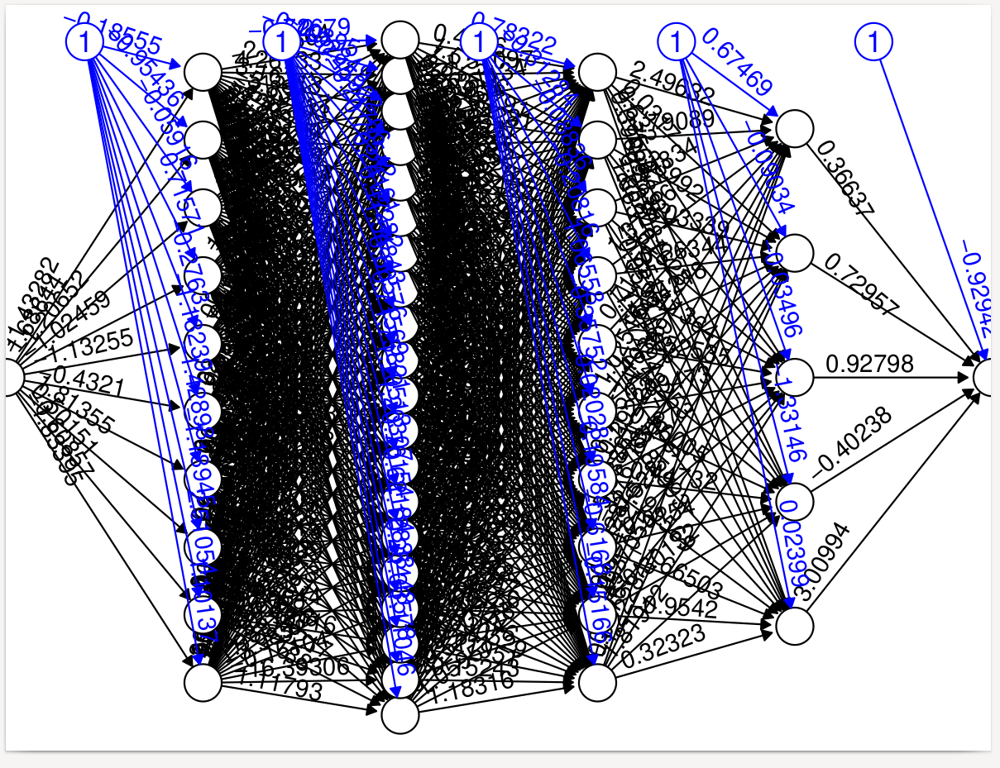
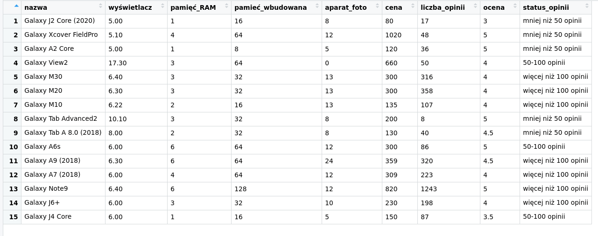
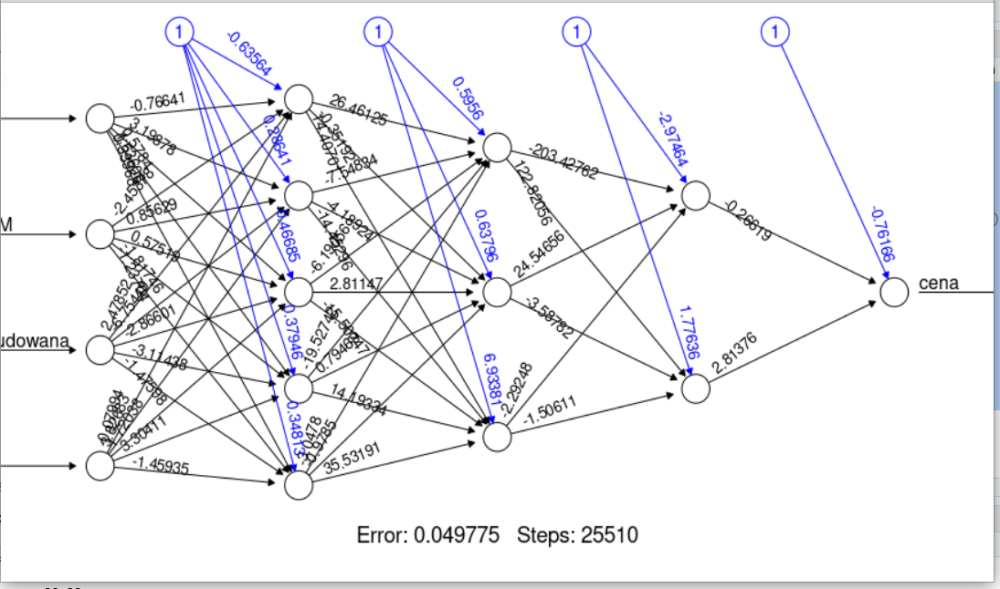

\begin{center}
\textbf{\LARGE SPRAWOZDANIE}\\
\begin{Large}
Zajęcia: Analiza procesów uczenia\\
Prowadzący: prof. dr hab. Vasyl Martsenyuk\\
\end{Large}

\vspace{5cm}
\textbf{Laboratorium 3}\\
\textbf{\today}\\
\textbf{Temat:} Użycie sztucznych sieci neuronowych\\
\textbf{Wariant:} 1\\
\textbf{Adres repozytorium:} \url{https://github.com/Konradbor/APU/tree/master/3}\\
\end{center}

\vfill

\begin{flushright}
Konrad Boroń\\
Informatyka II stopień,\\
stacjonarne,\\
7 semestr,\\
Gr. 1A\\
\end{flushright}
\pagebreak

1. Polecenie:

\begin{mdframed}
Zadanie dotyczy modelowania funkcji matematycznych za
pomoca sztucznej sieci neuronowej używajac paczke neuralnet. Rozważamy
źmienne niezależna x. Celem jest uzyskanie sieci neuronowej (zmieniajac
zarówno ilość warstw ukrytych jak i ilość neuronów) wype lniajacej warunek
Error < 0.01.

Funkcja: 1. $$f(x) = x ^ 3 + 2 ∗ x, x ∈ [1; 100]$$
\end{mdframed}

2. Wprowadzane dane:

   Po wielu próbach postanowiono ustalić 4 ukryte warstwy neuronów, w ilościach
   10,20,10 i 5. Dodatkowo dane są skalowane przed i po przetwarzaniu. Zwiększono
   również parametr threshold, tak aby sieć wykonała więcej kroków nauki.

3. Wykorzystane komendy:

   a) kod źródłowy A

```r
if (!require("neuralnet")){ install.packages("neuralnet"); library("neuralnet")}

f1 <- function(x){
   x ^ 3 + 2 * x
}

x <- seq(1,20)
y <- sapply(x, f1)
df <- data.frame(x,y)

xs <- scale(x, center = F)
ys <- scale(y, center = F)
dfs <- data.frame(xs,ys)

xsu <- xs * attr(xs, 'scaled:scale')


nn <- neuralnet(ys~xs, data=dfs, hidden=c(10,20,10,5), rep=2, linear.output = T, threshold = 0.000001)

plot(nn, rep="best", file="nn.png")
dev.print(pdf, "nn.pdf")

test <- data.frame(x = seq(1,100))
tests <- data.frame(xs = test$x / attr(xs, 'scaled:scale'))

results <- compute(nn, tests)
results$net.result
data.frame(predicted = results$net.result * attr(ys, 'scaled:scale'), actual = sapply(seq(1,100), f1))
```

4. Wynik działania:


   

   Wielkość sieci powoduje ucięcie wykresu.

```r
> data.frame(predicted = results$net.result * attr(ys, 'scaled:scale'), actual = sapply(seq(1,100), f1))
   predicted  actual
1       3.318319       3
2      11.286858      12
3      32.855573      33
4      72.520011      72
5     135.586914     135
6     228.083681     228
7     356.497988     357
8     527.360543     528
9     746.818484     747
10   1020.472496    1020
11   1353.681258    1353
12   1752.172905    1752
13   2222.419875    2223
14   2771.303008    2772
15   3405.157363    3405
16   4128.971869    4128
17   4947.120201    4947
18   5866.558282    5868
19   6898.092220    6897
20   8039.722112    8040
21   9230.180755    9303
22  10324.168711   10692
23  11177.688838   12213
24  11757.433389   13872
25  12122.712812   15675
26  12349.099933   17628
27  12492.103675   19737
28  12585.610506   22008
29  12649.119004   24447
30  12693.808311   27060
31  12726.228546   29853
32  12750.344879   32832
33  12768.645873   36003
34  12782.749921   39372
35  12793.744823   42945
36  12802.383682   46728
37  12809.201599   50727
38  12814.587461   54948
39  12818.829497   59397
40  12822.145011   64080
41  12824.700310   69003
42  12826.624377   74172
43  12828.018447   79593
44  12828.962844   85272
45  12829.521945   91215
46  12829.747837   97428
47  12829.683047  103917
48  12829.362616  110688
49  12828.815669  117747
50  12828.066645  125100
51  12827.136242  132753
52  12826.042169  140712
53  12824.799734  148983
54  12823.422315  157572
55  12821.921738  166485
56  12820.308579  175728
57  12818.592403  185307
58  12816.781964  195228
59  12814.885360  205497
60  12812.910157  216120
61  12810.863489  227103
62  12808.752139  238452
63  12806.582600  250173
64  12804.361117  262272
65  12802.093728  274755
66  12799.786285  287628
67  12797.444471  300897
68  12795.073809  314568
69  12792.679670  328647
70  12790.267271  343140
71  12787.841670  358053
72  12785.407765  373392
73  12782.970285  389163
74  12780.533781  405372
75  12778.102619  422025
76  12775.680972  439128
77  12773.272813  456687
78  12770.881902  474708
79  12768.511787  493197
80  12766.165796  512160
81  12763.847032  531603
82  12761.558371  551532
83  12759.302462  571953
84  12757.081728  592872
85  12754.898362  614295
86  12752.754339  636228
87  12750.651411  658677
88  12748.591120  681648
89  12746.574798  705147
90  12744.603579  729180
91  12742.678402  753753
92  12740.800025  778872
93  12738.969029  804543
94  12737.185832  830772
95  12735.450695  857565
96  12733.763734  884928
97  12732.124929  912867
98  12730.534133  941388
99  12728.991085  970497
100 12727.495419 1000200
```

Jak można zauważyć, od wyniku nr 20 błąd zaczyna się powiększać -- jest to taka
sama liczba, jak długość danych treningowych.

5. Wnioski:

   Sieć neuronowa w miarę dobrze oblicza wyniki dla danych treningowych, lecz z 
   każdym następnym x zwiększonym o 1 poza zakres danych uczenia, błąd 
   przewidywania jest coraz większy.
   Dodatkowo w pewnym momencie wartość y przestaje rosnąć.

---

1. Polecenie:

\begin{mdframed}
Zadanie dotyczy prognozowania ceny urzadzeń RTV AGD
(error $\leq$ 100 zł), określonych na Zajeciu 1. Używajac metody sztucznych sieci
neuronowych opracować plik w jezyku R z wykorzystaniem paczki neuralnet.
\end{mdframed}

2. Wprowadzane dane:

   

3. Wykorzystane komendy:

   a) kod źródłowy A

```r
if (!require("neuralnet")){ install.packages("neuralnet"); library("neuralnet")}

load("../1/ramka_smartfony")

input <- data.frame(wyświetlacz = ramka$wyświetlacz, pamięć_RAM=ramka$pamięć_RAM, cena = ramka$cena,
                    aparat_foto = ramka$aparat_foto, pamieć_wbudowana = ramka$pamieć_wbudowana )
inputs <- scale(input, center = F)
nn <- neuralnet(cena~wyświetlacz+pamięć_RAM+pamieć_wbudowana+aparat_foto, inputs, hidden=c(5,3,2), rep=2, threshold = 0.0001)

plot(nn, rep="best")

test <- data.frame(wyświetlacz = 5.0 / attr(inputs, 'scaled:scale')["wyświetlacz"],
                   pamięć_RAM = 1/ attr(inputs, 'scaled:scale')["pamięć_RAM"],
                   pamieć_wbudowana = 16/ attr(inputs, 'scaled:scale')["pamieć_wbudowana"],
                   aparat_foto = 8/ attr(inputs, 'scaled:scale')["aparat_foto"])

results <- compute(nn, test)
results
results$net.result * attr(inputs, 'scaled:scale')["cena"]
```

4. Wynik działania:

    ```r
    > results$net.result * attr(inputs, 'scaled:scale')["cena"]
               [,1]
    wyświetlacz 79.8266
    ```



5. Wnioski:

    Na podstawie otrzymanego wyniku można stwierdzić, że wynik mieści się w granicy zakładanego błędu.
    Po podaniu takich samych danych jak dla modelu Galaxy J2 Core (2020), kosztującego 80 euro,
    otrzymujemy wynik 79,8266.

```r
test <- data.frame(wyświetlacz = 6.4 / attr(inputs, 'scaled:scale')["wyświetlacz"],
                     pamięć_RAM = 6/ attr(inputs, 'scaled:scale')["pamięć_RAM"],
                     pamieć_wbudowana = 128/ attr(inputs, 'scaled:scale')["pamieć_wbudowana"],
                     aparat_foto = 12/ attr(inputs, 'scaled:scale')["aparat_foto"])
  
results <- compute(nn, test)
results
results$net.result * attr(inputs, 'scaled:scale')["cena"]
```

```r
>     results$net.result * attr(inputs, 'scaled:scale')["cena"]
                [,1]
wyświetlacz 819.9811
```

Po podaniu danych dla modelu Galaxy Note 9, otrzymujemy wynik 819,9811 euro, co 
jest zadowalającym wynikiem, ponieważ w danych wejściowych ten telofon ma cenę 820 euro.

