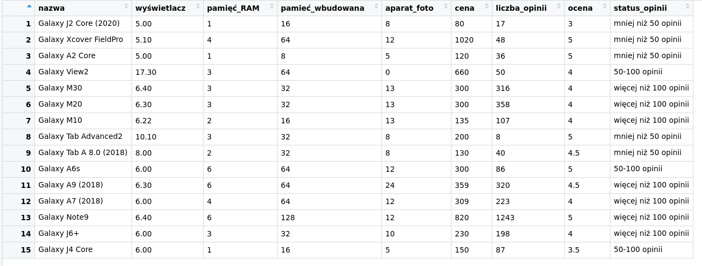
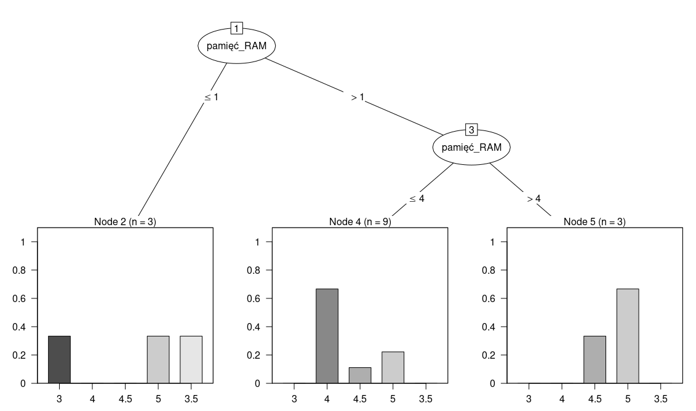

\begin{center}
\textbf{\LARGE SPRAWOZDANIE}\\
\begin{Large}
Zajęcia: Analiza procesów uczenia\\
Prowadzący: prof. dr hab. Vasyl Martsenyuk\\
\end{Large}

\vspace{5cm}
\textbf{Laboratorium 4}\\
\textbf{\today}\\
\textbf{Temat:} Uczenie maszynowe z użyciem drzew decyzyjnych\\
\textbf{Wariant:} 1\\
\textbf{Adres repozytorium:} \url{https://github.com/Konradbor/APU/tree/master/4}\\
\end{center}

\vfill

\begin{flushright}
Konrad Boroń\\
Informatyka II stopień,\\
stacjonarne,\\
7 semestr,\\
Gr. 1A\\
\end{flushright}
\pagebreak

1. Polecenie:

\begin{mdframed}
Zadanie dotyczy prognozowania oceny klientów (w skali 5-punktowej, Error < 5\%)
 urzadzeń RTV AGD. Używajac metody indukcji drzewa decyzji
C5.0 opracować plik w jezyku R z wykorzystaniem paczki C50.

1. Smartfon Samsung z systemem Android 6, ośmiordzieniowym procesorem.
Uwzglendniamy nastepijace dane: wyświetlacz, pamieć RAM,
pamieć wbudowana, aparat foto. Komunikacja (wifi itp) nie ma znaczenia.
Dane (>10 smartfonów) pobrać ze strony
http://www.euro.com.pl
\end{mdframed}

2. Wprowadzane dane:

   Dane smartfonów z laboratorium 1.

    

3. Wykorzystane komendy:

   a) kod źródłowy A

```r
if (!require("C50")){ install.packages("C50"); library("C50")}

load("../1/ramka_smartfony")

input <- data.frame(subset(ramka, select = -c(status_opinii, nazwa, ocena,liczba_opinii)))
tree <- C5.0.default(x=input, y=ramka$ocena)

predict.C5.0(tree, input)

summary(tree)
plot(tree)
```

4. Wynik działania:

```r
> source('~/Dokumenty/APU/4/4.R', echo=TRUE)

>   if (!require("C50")){ install.packages("C50"); library("C50")}

>   load("../1/ramka_smartfony")

>   input <- data.frame(subset(ramka, select = -c(status_opinii, nazwa, ocena,liczba_opinii)))

>   tree <- C5.0.default(x=input, y=ramka$ocena)

>   predict.C5.0(tree, input)
 [1] 3 5 3 4 4 4 4 5 5 5 5 4 5 4 3
Levels: 3 4 4.5 5 3.5

>   summary(tree)

Call:
C5.0.default(x = input, y = ramka$ocena)


C5.0 [Release 2.07 GPL Edition]  	Sun Jun 14 04:46:34 2020
-------------------------------

Class specified by attribute `outcome'

Read 15 cases (7 attributes) from undefined.data

Decision tree:

pamięć_RAM <= 1: 3 (3/2)
pamięć_RAM > 1:
:...pamięć_RAM > 4: 5 (3/1)
    pamięć_RAM <= 4:
    :...liczba_opinii <= 48: 5 (3/1)
        liczba_opinii > 48: 4 (6)


Evaluation on training data (15 cases):

	    Decision Tree   
	  ----------------  
	  Size      Errors  

	     4    4(26.7%)   <<


	   (a)   (b)   (c)   (d)   (e)    <-classified as
	  ----  ----  ----  ----  ----
	     1                            (a): class 3
	           6                      (b): class 4
	                       2          (c): class 4.5
	     1                 4          (d): class 5
	     1                            (e): class 3.5


	Attribute usage:

	100.00%	pamięć_RAM
	 60.00%	liczba_opinii


Time: 0.0 secs


>   plot(tree)
```



5. Wnioski:

   Z drzewa decyzyjnego można wywnioskować, że najważniejszą cechą smartfona dla
	 kupujących jest pamięć RAM. Im większa jej ilość, tym produkt ma lepszą ocenę.

	 Telefony z ilością pamięci RAM mniejszą niż 1 GB, jako jedyne dostały ocenę 3.
	 Za to telefony z więcej niż 4 GB pamięci, otrzymały ocenę co najmniej 4,5.
