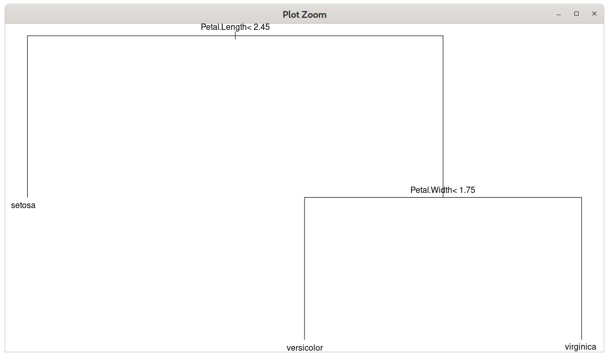

\begin{center}
\textbf{\LARGE SPRAWOZDANIE}\\
\begin{Large}
Zajęcia: Analiza procesów uczenia\\
Prowadzący: prof. dr hab. Vasyl Martsenyuk\\
\end{Large}

\vspace{5cm}
\textbf{Laboratorium 5}\\
\textbf{\today}\\
\textbf{Temat:} Modelowanie procesów uczenia maszynowego w pakecie mlr. Trenowanie, ocena i porównywanie modeli w pakecie mlr\\
\textbf{Wariant:} 1\\
\textbf{Adres repozytorium:} \url{https://github.com/Konradbor/APU/tree/master/5}\\
\end{center}

\vfill

\begin{flushright}
Konrad Boroń\\
Informatyka II stopień,\\
stacjonarne,\\
7 semestr,\\
Gr. 1A\\
\end{flushright}
\pagebreak

1. Polecenie:

\begin{mdframed}
Zadanie dotyczy konstruowania drzew decyzyjnych oraz
regul klasyfikacyjnych na podstawie zbioru danych (library(MASS lub datasets)).
Warianty zadania
1. iris
\end{mdframed}

2. Wprowadzane dane:

   Wczytany zbiór danych jest dostarczany razem z R. 
   Jest to zbiór pomiarów długości różnych elementów kwiatów irysa, dostępny jako `iris`.
   Każdy pomiar jest opatrzony adnotacją dotyczącą przynaleźności gatunkowej.

   

3. Wykorzystane komendy:

   a) kod źródłowy A

      ```r
      if (!require("mlr")){ install.packages("mlr"); library("mlr")}
      if (!require("rpart")){ install.packages("rpart"); library("rpart")}
      if (!require("partykit")){ install.packages("partykit"); library("partykit")}
      if (!require("C50")){ install.packages("C50"); library("C50")}

      rtree <- rpart(Species ~ ., iris)
      par(mar = rep(0,4))
      plot(rtree)
      text(rtree)

      ctr <- ctree(Species ~ ., iris)
      plot(ctr)

      input <- subset(iris, select = -c(Species))
      tree <- C5.0.default(x=input, y=iris$Species)

      summary(tree)
      plot(tree)


      classif <- C5.0(Species ~ ., data = iris, rules = T)
      summary(classif)
      ```

4. Wynik działania:

```r
```





Reguły klasyfikacyjne z pakietu C5.0:

```r
> summary(classif)

Call:
C5.0.formula(formula = Species ~ ., data = iris, rules = T)


C5.0 [Release 2.07 GPL Edition]  	Sun Jun 14 18:18:07 2020
-------------------------------

Class specified by attribute `outcome'

Read 150 cases (5 attributes) from undefined.data

Rules:

Rule 1: (50, lift 2.9)
	Petal.Length <= 1.9
	->  class setosa  [0.981]

Rule 2: (48/1, lift 2.9)
	Petal.Length > 1.9
	Petal.Length <= 4.9
	Petal.Width <= 1.7
	->  class versicolor  [0.960]

Rule 3: (46/1, lift 2.9)
	Petal.Width > 1.7
	->  class virginica  [0.958]

Rule 4: (46/2, lift 2.8)
	Petal.Length > 4.9
	->  class virginica  [0.938]

Default class: setosa


Evaluation on training data (150 cases):

	        Rules     
	  ----------------
	    No      Errors

	     4    4( 2.7%)   <<


	   (a)   (b)   (c)    <-classified as
	  ----  ----  ----
	    50                (a): class setosa
	          47     3    (b): class versicolor
	           1    49    (c): class virginica


	Attribute usage:

	 96.00%	Petal.Length
	 62.67%	Petal.Width


Time: 0.0 secs

```

5. Wnioski:

   Silnym parametrem klasyfikującym jest długość płatka kwiatu `Petal.length`.
   Wszystkie badane osobniki z gatunku *Setosa* miały długość mniejszą niż lub równą 1,9.

   Biblioteka C5.0 tworzy minimalne drzewo decyzyjne nawet z dużej liczby osobników.
   Dzięki temu można znaleźć cechy charakterystyczne dla danej klasy.

   Reguły klasyfikacyjne pokazują w jaki sposób można sklasyfikować dany gatunek,
   za pomocą zebranych parametrów. Dodatkowo jeśli jakaś reguła powoduje błędną
   klasyfikację, zostanie ona wyszczególniona, oraz jej błąd zostanie obliczony
   w procentach.

---

1. Polecenie:

\begin{mdframed}
Zadanie 2. Zadanie dotyczy prognozowania oceny klientów (w skali
5-punktowej, Error < 5\%) urzadzeń RTV AGD, określonych na Zajeciu 1.
Rozwiazanie polega na użyciu pakietu mlr. Należy wybrać najlepsza metode
wśród 5 możliwych z punktu widzenia przecyzyjności. Wyniki porównywania
precyzyjności metod należy przedstawić w postaci graficznej.
\end{mdframed}

2. Wprowadzane dane:

   Lista smartfonów z zadania 1.

   

3. Wykorzystane komendy:

   a) kod źródłowy A

```r
if (!require("mlr")){ install.packages("mlr"); library("mlr")}
if (!require("rFerns")){ install.packages("rFerns"); library("rFerns")}
if (!require("randomForestSRC")){ install.packages("randomForestSRC")}

load("../1/ramka_smartfony")

input <- data.frame(name = ramka$nazwa, 
                    display = ramka$wyświetlacz,
                    RAM = ramka$pamięć_RAM,
                    ROM = ramka$pamieć_wbudowana,
                    camera = ramka$aparat_foto,
                    price = ramka$cena,
                    grade = ramka$ocena)

task = makeClassifTask(id = deparse(substitute(input)), input, "grade",
                  weights = NULL, blocking = NULL, coordinates = NULL,
                  positive = NA_character_, fixup.data = "warn", check.data = TRUE)

lrns <- makeLearners(c("rpart", "C50","rFerns", "randomForestSRC"), type = "classif")
resamp <- makeResampleDesc(method = "CV", iters = 2)
porownanie <- benchmark(learners = lrns,
                        tasks = task,
                        resampling = resamp)
porownanie

plotBMRSummary(porownanie)
plotBMRBoxplots(porownanie)
```

4. Wynik działania:

```r
> porownanie <- benchmark(learners = lrns,
+                         tasks = task,
+                         resampling = resamp)
Task: input, Learner: classif.rpart
Resampling: cross-validation
Measures:             mmce      
[Resample] iter 1:    0.6250000 
[Resample] iter 2:    0.5714286 


Aggregated Result: mmce.test.mean=0.5982143


Task: input, Learner: classif.C50
Resampling: cross-validation
Measures:             mmce      
[Resample] iter 1:    0.7500000 
[Resample] iter 2:    0.5714286 


Aggregated Result: mmce.test.mean=0.6607143


Task: input, Learner: classif.rFerns
Resampling: cross-validation
Measures:             mmce      
[Resample] iter 1:    0.7500000 
[Resample] iter 2:    0.7142857 


Aggregated Result: mmce.test.mean=0.7321429


Task: input, Learner: classif.randomForestSRC
Resampling: cross-validation
Measures:             mmce      
[Resample] iter 1:    0.6250000 
[Resample] iter 2:    0.7142857 


Aggregated Result: mmce.test.mean=0.6696429


> porownanie
  task.id              learner.id mmce.test.mean
1   input           classif.rpart      0.5982143
2   input             classif.C50      0.6607143
3   input          classif.rFerns      0.7321429
4   input classif.randomForestSRC      0.6696429
```


5. Wnioski:

    Na podstawie otrzymanego wyniku można stwierdzić, że metodą, która klasyfikuje
    oceny klientów z najmniejszym średnim błędem jest `rpart`.

    
